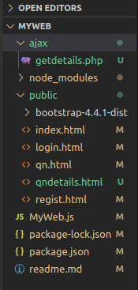
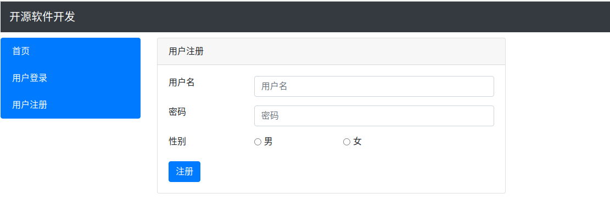
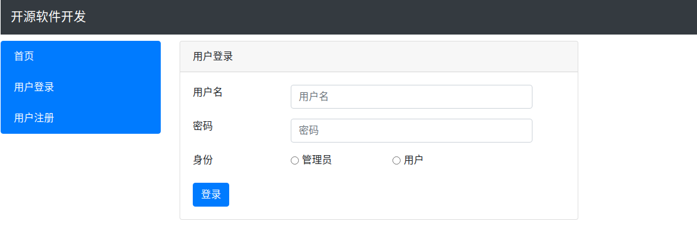
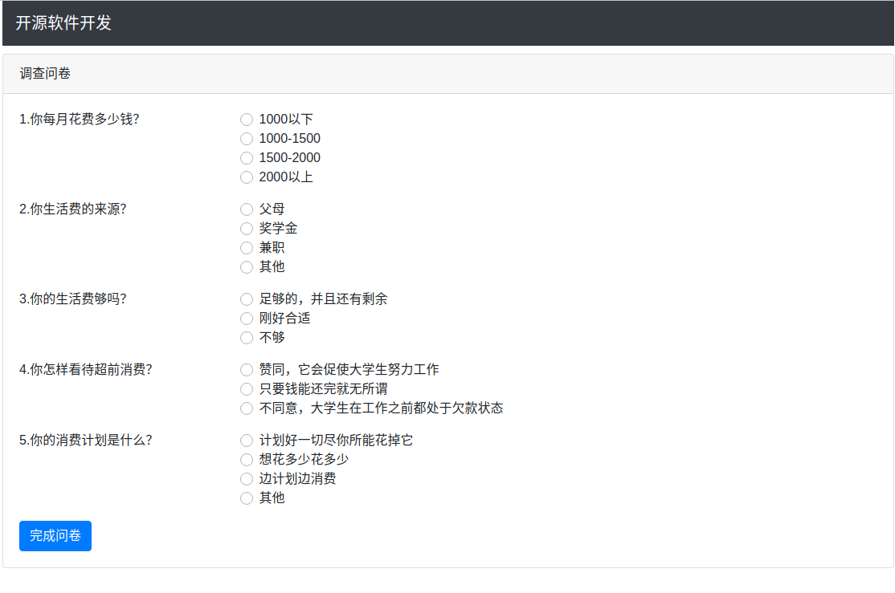
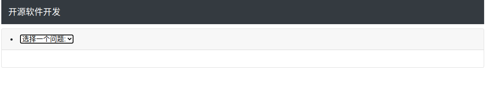

# 1.项目设计部分

## （1）项目总体构成

1）用户登录功能

2）用户注册功能

3）调查问卷功能

4）调查结果功能

## （2）引入的包在项目中的作用相关说明

1）express：进行路由管理

2）ejs：渲染页面（本项目中没有实际用到）

3）mongoose：建立数据模型，便捷使用数据库

4）ajax：实时进行数据交换并更新网络内容（本项目尝试使用）

5）php：配合ajax进行数据库数据查询并实时更新网页（本项目尝试使用失败）

## （3）项目目录结构和各个部分的说明

1）ajax文件夹：

包含getdetails.php文件，用来配合ajax连接mongodb实时更新查询数据

2）public文件夹：

1. bootstrap文件夹：引入bootstrap框架，美化网页界面
2. index.html文件：首页
3. login.html文件：用户登录界面
4. qn.html文件：调查问卷界面
5. qndetails.html文件：调查结果界面
6. regist.html文件：用户注册界面

3）Myweb.js文件：主程序

4）readme.md：说明文件

# 2.使用说明书

（1）用户注册功能：

输入用户名，密码，选择性别进行注册

注册失败将重新回到空白注册界面

注册成功则跳转至用户登陆界面

（2）用户登录功能：

输入用户名，密码，选择身份进行登陆

用户名密码错误或身份选择错误则会重新回到空白登录界面

用户登陆成功则跳转到调查问卷界面

管理员登陆成功则跳转到调查结果界面

（3）调查问卷功能：

选择完5道单项选择题，点击“完成问卷”按钮则跳转回首页

（4）调查结果功能：

点击下拉选项按钮选择一个问题

选择之后目标为出现该问题每个选项的选择个数	

# 3.开发日记（与commit对应）

## 2021.12.19（1st commit）

（1）进行了项目的创建，git初始化

（2）远程仓库的连接

（3）安装了express，mongoose等依赖

## 2021.12.31（2nd commit）

（1）安装了ejs依赖

（2）引用了上学期web开发大作业中的部分代码，初步完成了用户注册，登陆功能，并设计了调查问卷

（3）使用了bootstrap框架，使网页更美观

## 2021.1.1（3rd commit）

（1）完善了注册，登陆功能，区分了管理员和用户登陆

（2）编写了调查问卷界面和调查结果界面

（3）安装了ajax依赖

（4）尝试配置php环境并配合ajax使用，实时更新数据库查询，使用pecl安装mongodb插件出错无法解决